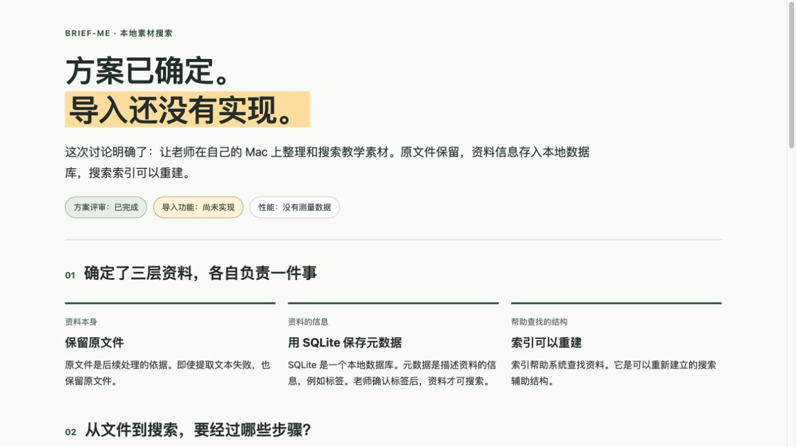

# brief-me 0.1.0 执行记录

日期：2026-10-02。被测对象：`skills/brief-me/`。本记录的素材是隔离的测试对话；示例提到的素材搜索系统不是本仓库实现的功能。

## 结果

| 项目 | 结果与证据 |
| --- | --- |
| 技能格式 | skill-creator 的 `quick_validate.py` 通过；相对引用、Codex 元数据长度和默认调用检查通过。初稿 description 中的冒号导致 YAML 失败，改为折叠标量后通过。 |
| 中文文字 | [修订后输出](artifacts/text/chinese.md)保留空查询失败、没有教师试用、不能声称可发布。没有重新运行示例项目代码，输出如实说明依据。 |
| 英文严格请求 | [英文草稿](artifacts/text/strict-unverified.md)在完整标准和词典不可用时交付有用解释，并明确完整合规未经验证；未冒充正式合规稿。 |
| 图片 | 实际生成 [PNG](artifacts/image/system-boundary.png) 与 [SVG](artifacts/image/system-boundary.svg)。独立执行者与主代理分别查看 PNG，检查中文、箭头方向、失败重试与尚未实现状态。 |
| 网页 | [实际 HTML](artifacts/web/index.html)通过主代理独立浏览器交互检查，详情见下方。 |
| 无视频工具 | [实际回复](artifacts/video-blocked/final-response.md)与[分镜中间稿](artifacts/video-blocked/storyboard.md)明确视频未完成，未虚构 MP4 或已同步字幕。 |
| 本机视频成功路径 | **阻塞，未验证**。`say` 列出中文声音，但三次实际输出均为零时长 AIFF。[检查记录](artifacts/video-local/verification.md)、[ffprobe 结果](artifacts/video-local/voice-probe.json)及原始失败音频已保留。没有渲染样段或最终视频。根因未确定。 |
| 项目内安装 | `.agents/skills/brief-me` 与 `.claude/skills/brief-me` 的链接均指向可分发源目录，入口字节一致。没有在重启后的多个客户端中逐一验证技能发现。 |

## 实际浏览器检查

主代理通过 Codex 内置浏览器访问独立执行者生成的原始 HTML，操作页面可见控件建立状态，没有直接改内部状态。

- 初始结论、方案状态及无性能数据可见。
- 前进经过提取、索引、搜索，终点禁用下一步。
- 上一步和从头查看恢复正确内容及按钮状态。
- 直接选步可切换搜索步骤。
- 进入提取失败分支后，保留原文件、可重试、重试结果未知均可见。
- 用 Enter 触发重试与失败按钮，焦点和页面内容正确变化。
- 390 × 844 窄屏查看流程和失败分支，标签可读；测得页面内容宽度未超视口。
- 禁用 JavaScript 后重新加载，核心结论、全部流程和失败说明仍可读。
- 浏览器没有捕获到错误或警告；检查后恢复 JavaScript 和默认视口。

未做屏幕阅读器实测、完整离线浏览器运行或所有浏览器组合测试。源码无外部资源或网络调用是静态检查结果，不等同离线运行验收。

## 执行发现与修正

- [首次中文输出](artifacts/text/initial.md)把未指定的搜索内容收窄为“资料名称”。入口增加“解释术语时保留原始范围，不添加未验证实现细节”；另一位执行者的复测没有该收窄。
- 图片初次栅格化丢失 SVG CSS/marker 箭头。执行者按技能的目视检查要求发现，改用显式几何线条后重新生成，主代理确认修正版。
- 图片规则区分了“生成 SVG 的能力”和“预览或转成位图的能力”。
- 视频规则区分了本地代码源文件和原生生成工具可保留的提示词、分镜等材料；明确“已有视频但无法解码检查”属于生成后未验证状态。

## 验收范围

以上证明这些固定场景下的实际行为，不证明所有模型、客户端和对话都能稳定获得同等结果。视频成功生成、旁白听感、字幕同步及真实用户理解程度均未验收。

完整资料来源和访问限制见 [source-notes.md](source-notes.md)。技能包不包含本目录的测试产物或失败音频。
